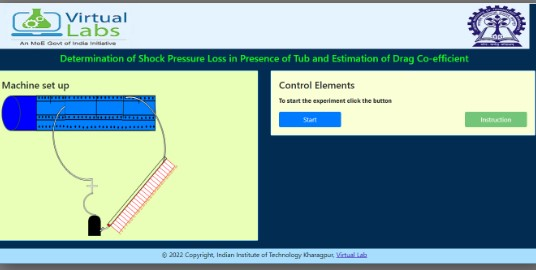
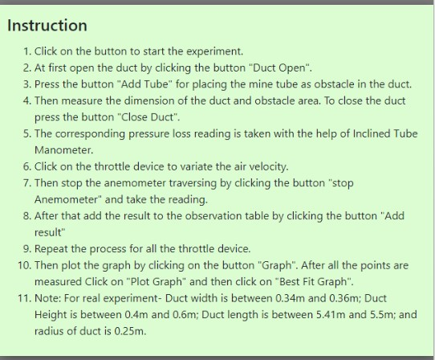
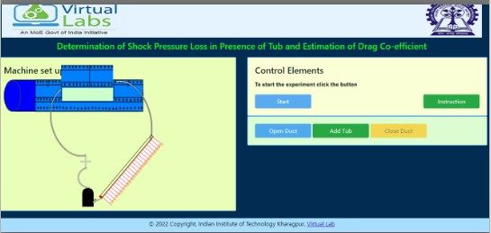
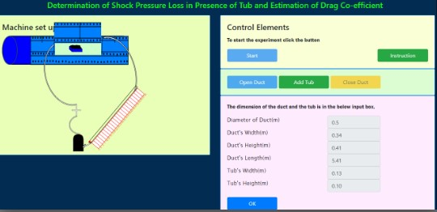
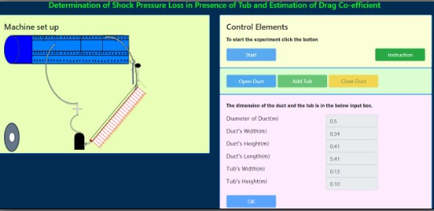
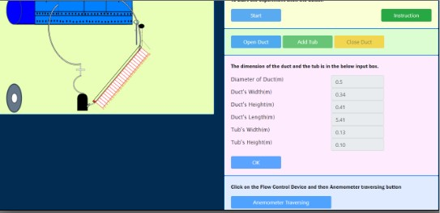
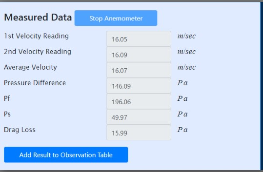
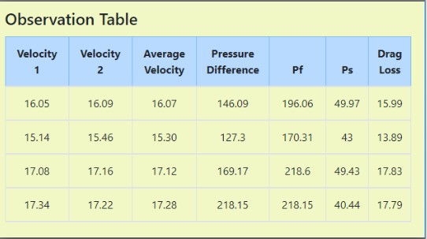
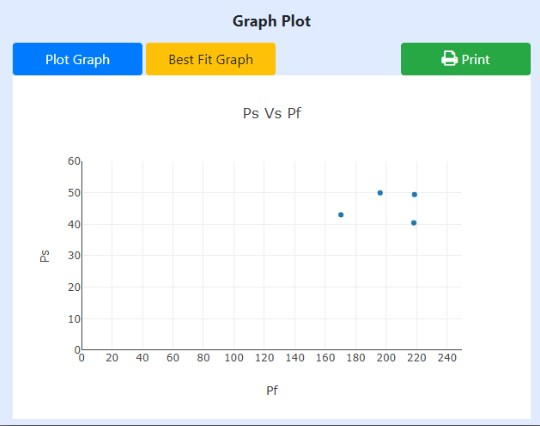
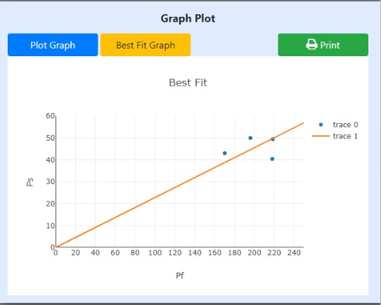

## Procedure

1. The dimensions of the duct and tubs are taken.
2. The cover of the duct is closed and the duct is made air tight with the help of putty (after placing the tubs).
3. The two ends of the DP Calc. are connected to the pressure tapping ends of the duct.
4. Fan is started
5. The corresponding pressure loss reading is taken with the help of DP Calc.
6. Anemometer traversing is done to measure the air velocity at the end of the duct, three readings are taken from which average velocity is found out.
7. Step 5& 6 are repeated for certain number of times, maintaining different flow conditions each time with the help of flow regulator (throttling devices).
8. Shock pressure losses are determined for each flow condition. Finally, a graph is plotted between shock pressure losses vs. $$  (\frac{1}{2} . \rho . V^2. \frac{S}{A}) $$ to find out the drag co-efficient.

## Simulation Procedure

The following procedure is to be followed by the user in order to determine the dragloss due to obstruction in a duct:

Click "Start" to start the experiment.

Read the Instructions Carefully here then press the button "Click Here".

After that click on the button "OPEN DUCT" for placing the obstacle in the duct's specified area.

Press the button "ADD TUB" for placing the mine tub as obstacle in the duct.

Then press "OK" after viewing the dimension of the duct and then press the Button "CLOSE DUCT".

Wait till the Duct's Open Space is not covered. Then Click on the flow control device to measure the air velocity and the pressure difference. Next click on "Anemometer Traversing" button.

After that Stop the Anemometer traversing by clicking the "Stop Anemometer" button.

When the data is generated then add the result  by clicking the "Add Result to the Observation table" button.

Repeat for regulating the air flow in the duct by flow control device, after 4  measurements plot the graph for coefficient of dragloss.

Add the best fit line by clicking the button "Add Best Fit Line" then print the graph by clicking the Print button.

